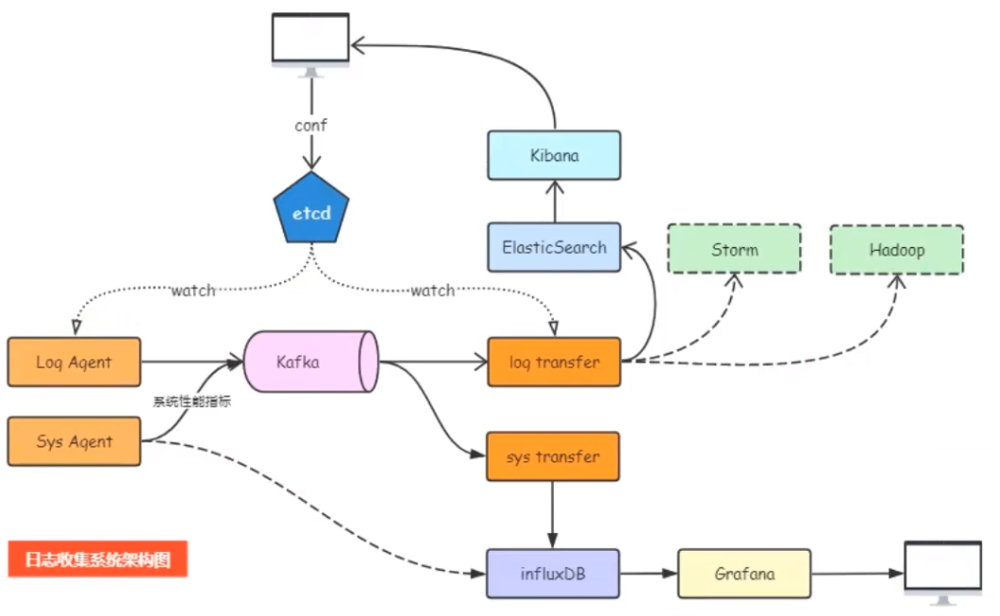

# logagent 一个日志收集项目
### 一、项目架构图


### 二、项目思路
   1. 通过将topic以及日志文件放到到etcd中,
   2. logagent从etcd 中获取到topic和日志文件
   3. 利用taillog模块，从日志文件中取出日志，放到kafka中
   4. 通过logtransfers，并将消息写道elasticsearch中
   5. 前端使用kibana就可以查看到放到elasticsearch的数据
### 三、环境搭建
   1. 配置jdk
   2. 安装zookeeper
   3. 安装kafka
   4. 安装etcd

### 四、启动

##### 1. 启动zookeper
``` bash
   zookeeper-server-start.bat ..\..\config\zookeeper.properties
```
##### 2. 启动kafka
``` bash
   kafka-server-start.bat ..\..\config\server.properties
```

##### 3. 创建主题
``` bash
   .\bin\windows\kafka-topics.bat --create --zookeeper localhost:2181 --replication-factor 1 --partitions 1 --topic test
```
##### 4. 查看主题
``` bash
   .\bin\windows\kafka-topics.bat --list --zookeeper localhost:2181
```
##### 5. 创建生产者
``` bash
   .\bin\windows\kafka-console-producer.bat --broker-list localhost:9092 --topic test
```
##### 6. 创建消费者
``` bash
   .\bin\windows\kafka-console-consumer.bat --bootstrap-server localhost:9092 --topic test --from-beginning
```
   至此上述启动成功，说明我们搭建的环境没有问题

##### 7. 启动etcd
```
   执行etcd.exe即可
   etcdctl.exe --endpoints=http://127.0.0.1:2379 put xxxx "xxxx"
   etcdctl.exe --endpoints=http://127.0.0.1:2379 get xxxx

```
   

